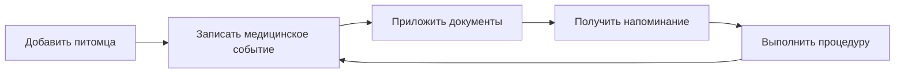

# Концепция продукта

Статус: **Концепция этапа 2 согласована**

Версия: **0.2**

## 1. Краткое определение

Pet Worth — мобильное приложение, в котором владелец хранит профиль и медицинскую историю питомца, получает напоминания о важных событиях и находит ветеринарную помощь поблизости.

## 2. Проблема

Данные о здоровье питомца часто распределены между бумажным ветпаспортом, фотографиями анализов, сообщениями, заметками и памятью владельца. Из-за этого сложно:

- быстро восстановить историю лечения;
- вовремя повторить вакцинацию или процедуру;
- передать врачу полную информацию;
- найти подходящую клинику в незнакомом районе;
- сохранить документы при потере бумажного паспорта.

## 3. Ценность продукта

> Вся важная информация о здоровье питомца — в одном месте и доступна тогда, когда она нужна владельцу или врачу.

Главный цикл ценности:

## 4. Целевая аудитория

### Основная

Владельцы одного или нескольких кошек и собак, которые самостоятельно следят за прививками, лечением и документами питомцев.

### Дополнительная

- члены семьи, совместно ухаживающие за питомцем;
- волонтёры и временные опекуны;
- ветеринарные специалисты, которым владелец временно показывает или передаёт историю.

Ветеринарная клиника как полноценный тип пользователя не входит в MVP.

## 5. Продуктовые принципы

1. **Медицинская карта важнее социальной механики.** Ядро продукта — достоверная история питомца.
2. **Владелец контролирует данные.** Документы закрыты по умолчанию и передаются только явно.
3. **Напоминание должно вести к событию.** Из уведомления пользователь сразу попадает в подробный просмотр соответствующего события.
4. **Никаких медицинских диагнозов от приложения.** Продукт хранит данные и помогает организовать уход, но не заменяет врача.
5. **Минимум ручного ввода.** Там, где возможно, используются шаблоны, повтор события и загрузка документа.
6. **Образ Сени задаёт характер бренда, но не структуру продукта.** Отсылки остаются на уровне логотипа, иллюстраций и визуальных деталей и не создают отдельного пользовательского сценария.

## 6. Состав MVP

### Обязательно

- регистрация и вход;
- профиль владельца;
- семейная группа и приглашение других пользователей;
- совместный доступ членов семьи к питомцам, медицинской истории и напоминаниям;
- создание нескольких профилей питомцев;
- имя, вид животного, пол, дата рождения или приблизительный возраст, порода, вес, фотография;
- медицинская хронология;
- типы событий второго среза: вакцинация, приём врача, анализ, процедура/операция;
- дата, название, необязательная заметка, фотографии и PDF;
- календарь событий всех питомцев на главной;
- необязательное уведомление за 24 часа для события с будущей датой;
- просмотр и скачивание вложений;
- курсы лекарств, расписание, уведомления и журнал фактических приёмов на третьем этапе;
- редактирование и удаление собственных данных;
- базовые настройки конфиденциальности и удаление аккаунта.

### Желательно, если не угрожает сроку MVP

- повторное событие на основе предыдущей вакцинации;
- фильтрация хронологии по типу;
- экспорт краткой медицинской карты в PDF;
- временная ссылка для врача только на чтение;
- карта клиник с адресами, часами работы и переходом к маршруту.

### Не входит в MVP

- собственные отзывы о клиниках;
- запись на приём внутри приложения;
- кабинеты клиник и врачей;
- медицинские рекомендации или постановка диагноза;
- распознавание анализов и ветпаспорта с помощью ИИ;
- платежи, страхование и интернет-магазин;
- публичная социальная лента.

Учёт лекарств не является обычным типом медицинского события. Он выделен в третий этап как курс с расписанием, уведомлениями и регистрацией фактических приёмов. Семейный доступ следует за ним на четвёртом этапе.
