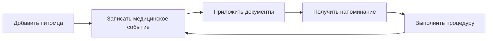
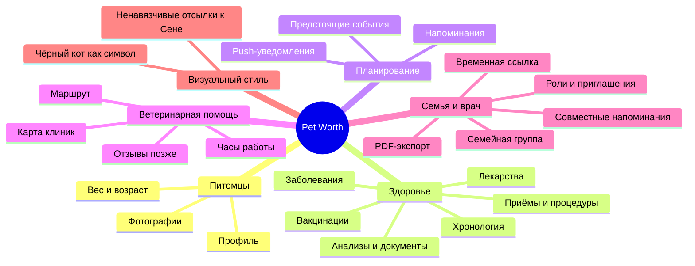

# Концепция продукта

Статус: **Черновик для согласования**  
Версия: **0.1**

## 1. Краткое определение

Pet Worth — мобильное приложение, в котором владелец хранит профиль и медицинскую историю питомца, получает напоминания о важных событиях и находит ветеринарную помощь поблизости.

Визуальный образ продукта вдохновлён чёрным котом Сеней. Отсылки к нему используются в логотипе, иллюстрациях и деталях интерфейса, но отдельной страницы или пользовательского раздела о Сене в приложении нет.

## 2. Проблема

Данные о здоровье питомца часто распределены между бумажным ветпаспортом, фотографиями анализов, сообщениями, заметками и памятью владельца. Из-за этого сложно:

- быстро восстановить историю лечения;
- вовремя повторить вакцинацию или процедуру;
- передать врачу полную информацию;
- найти подходящую клинику в незнакомом районе;
- сохранить документы при потере бумажного паспорта.

## 3. Ценность продукта

> Вся важная информация о здоровье питомца — в одном месте и доступна тогда, когда она нужна владельцу или врачу.

Главный цикл ценности:

## 4. Целевая аудитория

### Основная

Владельцы одного или нескольких кошек и собак, которые самостоятельно следят за прививками, лечением и документами питомцев.

### Дополнительная

- члены семьи, совместно ухаживающие за питомцем;
- волонтёры и временные опекуны;
- ветеринарные специалисты, которым владелец временно показывает или передаёт историю.

Ветеринарная клиника как полноценный тип пользователя не входит в MVP.

## 5. Продуктовые принципы

1. **Медицинская карта важнее социальной механики.** Ядро продукта — достоверная история питомца.
2. **Владелец контролирует данные.** Документы закрыты по умолчанию и передаются только явно.
3. **Напоминание должно вести к действию.** Из уведомления пользователь попадает к событию и может отметить его выполненным или перенести.
4. **Никаких медицинских диагнозов от приложения.** Продукт хранит данные и помогает организовать уход, но не заменяет врача.
5. **Минимум ручного ввода.** Там, где возможно, используются шаблоны, повтор события и загрузка документа.
6. **Образ Сени задаёт характер бренда, но не структуру продукта.** Отсылки остаются на уровне логотипа, иллюстраций и визуальных деталей и не создают отдельного пользовательского сценария.

## 6. Состав MVP

### Обязательно

- регистрация и вход;
- профиль владельца;
- семейная группа и приглашение других пользователей;
- совместный доступ членов семьи к питомцам, медицинской истории и напоминаниям;
- создание нескольких профилей питомцев;
- имя, вид животного, пол, дата рождения или приблизительный возраст, порода, вес, фотография;
- медицинская хронология;
- типы событий: вакцинация, заболевание, приём врача, процедура/операция, анализ, лекарство, другое;
- дата, описание, клиника/врач в виде текста, вложения;
- напоминание с конкретной датой;
- push-уведомление и список предстоящих событий;
- просмотр и скачивание вложений;
- редактирование и удаление собственных данных;
- базовые настройки конфиденциальности и удаление аккаунта.

### Желательно, если не угрожает сроку MVP

- повторное событие на основе предыдущей вакцинации;
- фильтрация хронологии по типу;
- экспорт краткой медицинской карты в PDF;
- временная ссылка для врача только на чтение;
- карта клиник с адресами, часами работы и переходом к маршруту.

### Не входит в MVP

- собственные отзывы о клиниках;
- запись на приём внутри приложения;
- кабинеты клиник и врачей;
- медицинские рекомендации или постановка диагноза;
- распознавание анализов и ветпаспорта с помощью ИИ;
- платежи, страхование и интернет-магазин;
- публичная социальная лента.

## 7. Карта продукта

## 8. Метрики проверки идеи

На первом этапе важны не установки сами по себе, а повторное использование:

- доля пользователей, создавших хотя бы одного питомца;
- доля питомцев, для которых добавлено медицинское событие;
- доля пользователей, создавших напоминание;
- возврат в приложение в течение 30 дней;
- доля сработавших напоминаний, после которых событие отмечено выполненным;
- доля пользователей, добавивших второй документ или событие.

## 9. Риски и решения

| Риск | Решение на первом этапе |
|---|---|
| Пользователь воспринимает приложение как медицинского советника | Явные формулировки: приложение не ставит диагнозы и не назначает лечение |
| Потеря чувствительных данных | Закрытый доступ по умолчанию, шифрование передачи, резервное копирование, удаление аккаунта |
| Напоминания не доставляются | Хранить статус события в приложении; push не является единственным источником информации |
| Карта клиник содержит устаревшие часы | Показывать источник и дату обновления, давать переход к первоисточнику |
| Отзывы накручиваются или используются для травли | Не включать собственные отзывы в MVP; позже — только после подтверждённого визита и с модерацией |
| Объём файлов быстро растёт | Ограничение размера и форматов, сжатие изображений, квоты хранения |

## 10. Вопросы для первого утверждения

1. Подтверждаем ли, что ядро MVP — медицинская карта и напоминания?
2. Нужна ли карта клиник уже в первой версии или переносим её в следующий релиз?
3. Нужен ли экспорт/доступ для врача в MVP?
4. Какие животные поддерживаются сначала: только кошки и собаки или любые питомцы?
