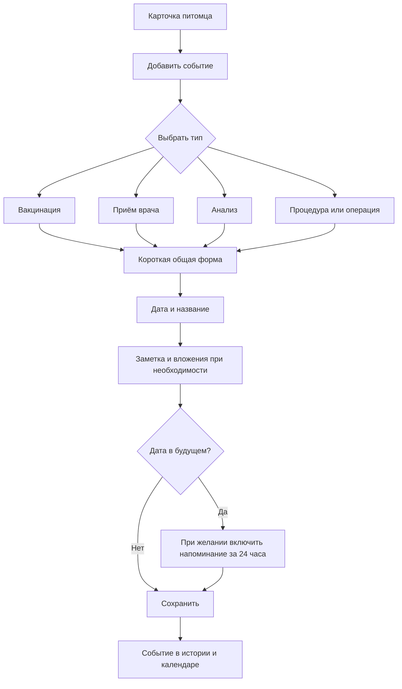
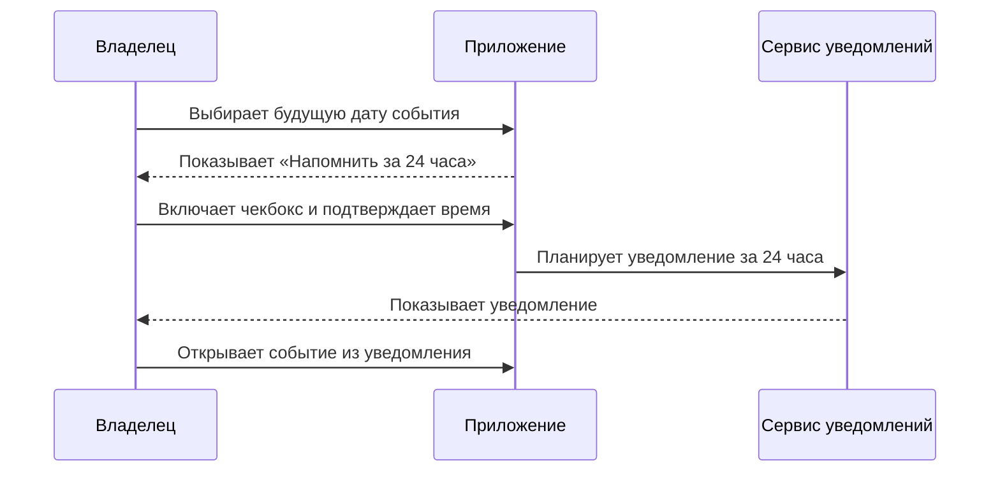
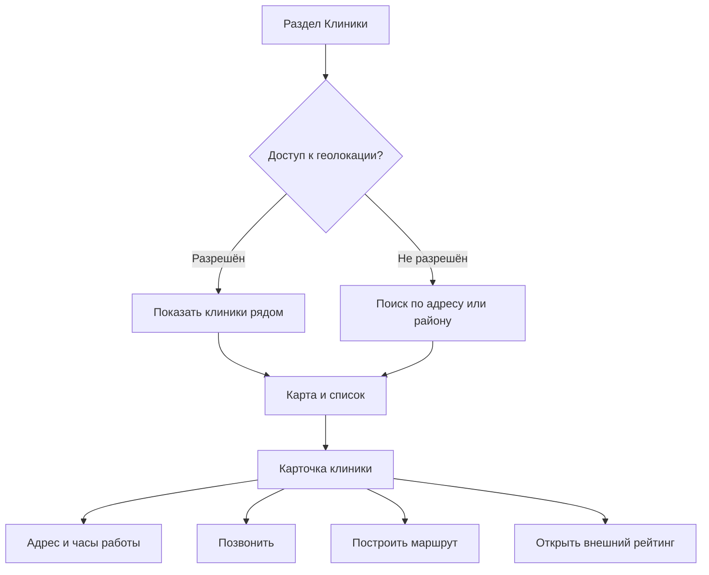
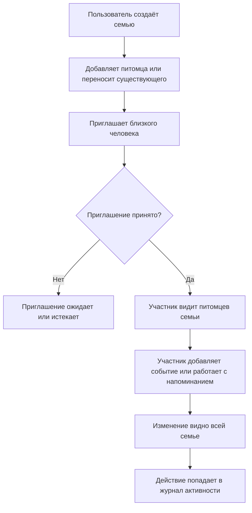

# Пользовательские потоки

Статус: **Поток этапа 2 согласован**

Версия: **0.2**

## 1. Общая навигация

Предлагаемая нижняя навигация мобильного приложения:

- **Главная** — карточки питомцев и календарь медицинских событий;
- **Питомцы** — список питомцев и их карты;
- **Клиники** — карта и список клиник, если функция входит в релиз;
- **Профиль** — аккаунт, семья, настройки конфиденциальности и экспорт.

## 2. Создание профиля питомца

### Переключение питомца на главной

- При одном питомце главная показывает одну статичную карточку без элемента переключения.
- При двух и более питомцах карточки переключаются горизонтальным свайпом.
- После свайпа интерфейс фиксируется на ближайшей карточке; нажатие на карточку открывает профиль выбранного питомца.
- Отдельная кнопка «Сменить питомца» не используется.

### Основной сценарий

1. Пользователь нажимает «Добавить питомца».
2. Загружает фотографию — необязательно.
3. Вводит имя и выбирает вид животного.
4. Указывает дату рождения либо приблизительный возраст.
5. Необязательно добавляет пол, породу и текущий вес.
6. Проверяет данные и сохраняет профиль.
7. Приложение предлагает добавить прививку или другое медицинское событие.

### Правила

- Для сохранения достаточно имени и вида животного.
- Неизвестная порода является нормальным состоянием, а не ошибкой.
- Если точная дата рождения неизвестна, хранится отметка, что возраст приблизительный.
- Удаление питомца требует подтверждения, поскольку удаляет связанную историю.

## 3. Добавление медицинского события

### Общие поля

- тип события выбирается на отдельном первом шаге;
- дата обязательна и по умолчанию равна сегодняшней;
- название обязательно и предварительно заполнено выбранным типом;
- заметка необязательна;
- одно или несколько фото либо PDF необязательны.

Питомец определяется из открытого профиля. Для четырёх типов используется одна форма, специализированных полей нет.

## 4. Напоминание о будущем событии

Чекбокс доступен только тогда, когда до события остаётся не менее 24 часов. Время по умолчанию — `10:00`. Изменение даты или времени перепланирует уведомление; отключение напоминания или удаление события отменяет его. Если уведомления запрещены системой, событие сохраняется с понятным предупреждением.

У события и напоминания нет пользовательских статусов. Событие считается состоявшимся по умолчанию.

## 5. Просмотр медицинской истории

1. Пользователь открывает карточку питомца.
2. Видит хронологию от новых событий к старым.
3. Открывает событие и просматривает заметку, фотографии и PDF.
4. Может изменить тип, дату, название, заметку и состав вложений.
5. Может удалить событие только из подробного просмотра и после обязательного подтверждения.

При удалении также удаляются вложения, отметка в календаре и запланированное уведомление.

## 6. Календарь медицинских событий

На главной странице календарь объединяет события всех питомцев. Дни отмечаются точками: зелёной для вакцинации, фиолетовой для приёма врача, синей для анализа и оранжевой для процедуры или операции. Числовые счётчики не используются; на одной дате показывается максимум одна точка каждого типа.

При выборе даты под календарём появляется краткий обзор с аватаром и именем питомца, типом, названием и индикатором вложений. Нажатие открывает подробный просмотр события.

## 7. Поиск клиники

### Ограничения первого релиза

- приложение не гарантирует актуальность часов работы;
- экстренная доступность клиники должна подтверждаться звонком;
- собственные отзывы отсутствуют;
- данные клиник берутся у выбранного поставщика карт/мест.

## 8. Передача данных врачу — опциональный сценарий MVP

1. Владелец выбирает питомца и период истории.
2. Исключает записи, которыми не хочет делиться.
3. Выбирает PDF или временную ссылку.
4. Для ссылки задаёт срок действия.
5. Врач получает доступ только на чтение.
6. Владелец может досрочно отозвать ссылку.

## 9. Пограничные сценарии

- уведомления запрещены системой;
- пользователь сменил часовой пояс;
- файл слишком большой или неподдерживаемого формата;
- питомец передан другому владельцу;
- пользователь создал дубликат вакцинации;
- пользователь изменил будущую дату после планирования уведомления;
- до будущего события осталось менее 24 часов;
- нет сети во время просмотра ранее загруженной карты;
- источник карт не вернул часы работы;
- владелец удаляет аккаунт с несколькими питомцами и документами.

## 10. Семья и совместный доступ

Полная механика, роли и диаграммы описаны в документе [«Семья и совместный доступ»](./05-family-sharing.md).

Ключевой сценарий:

