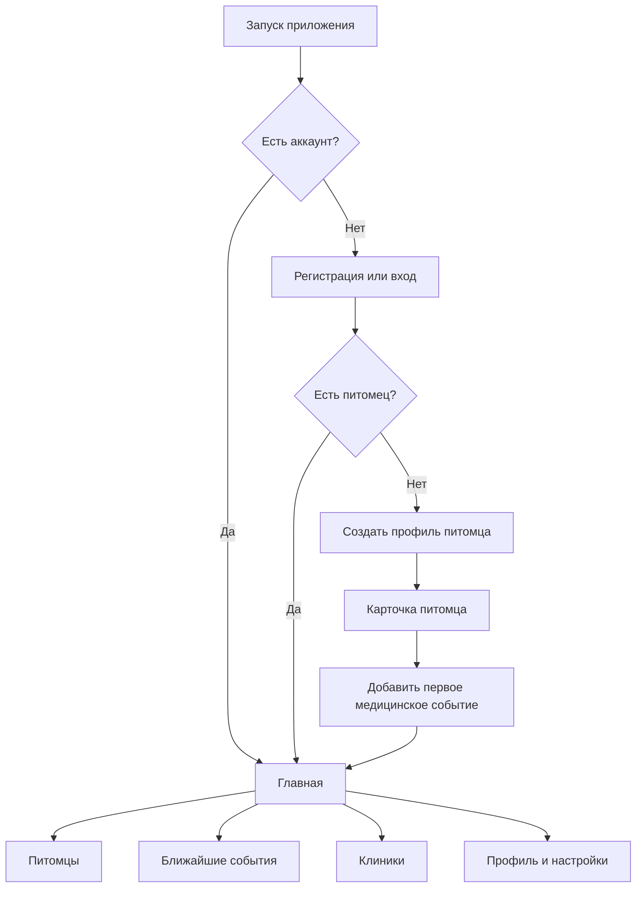
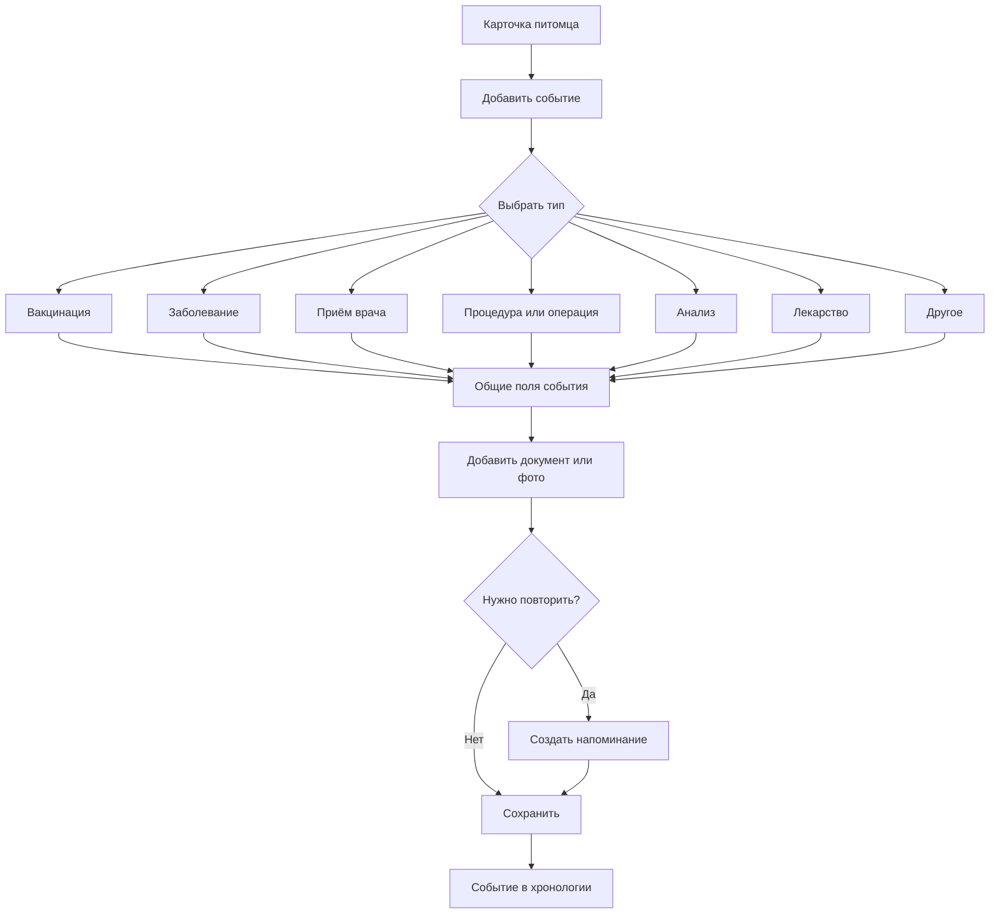
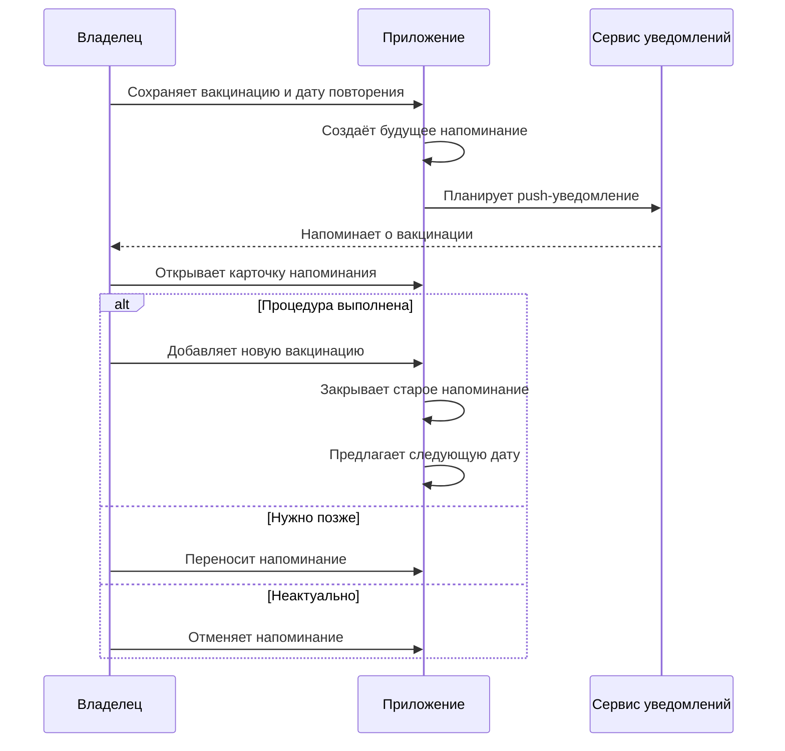
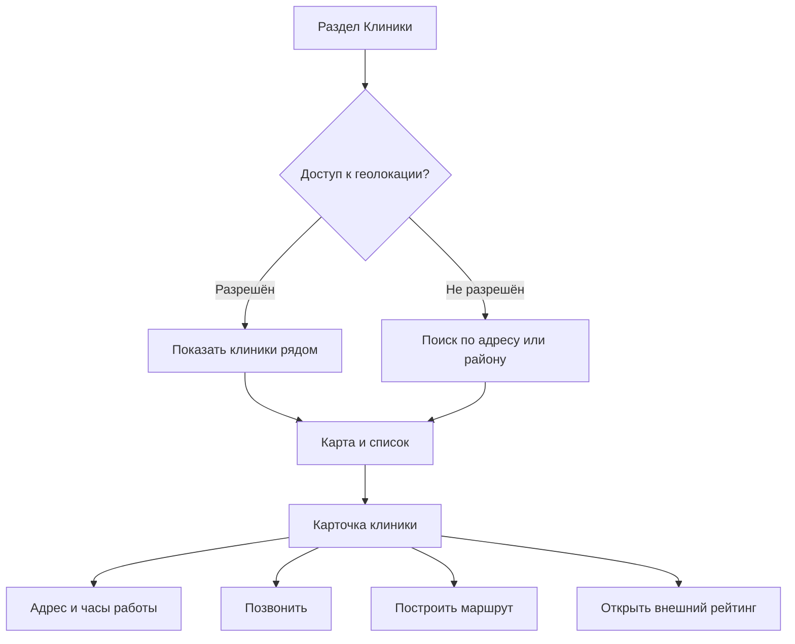
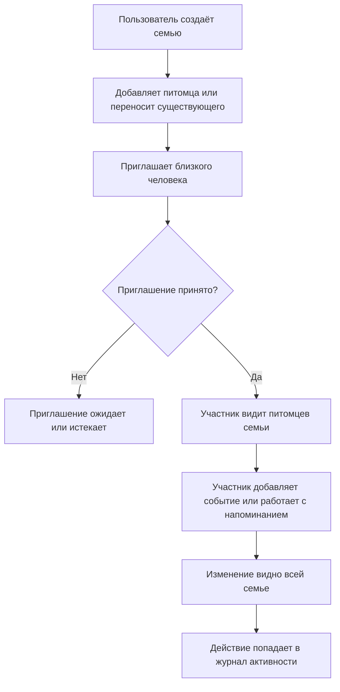

# Пользовательские потоки

Статус: **Черновик для согласования**  
Версия: **0.1**

## 1. Общая навигация

Предлагаемая нижняя навигация мобильного приложения:

- **Главная** — ближайшие напоминания и последние события;
- **Питомцы** — список питомцев и их карты;
- **Клиники** — карта и список клиник, если функция входит в релиз;
- **Профиль** — аккаунт, семья, настройки конфиденциальности и экспорт.

## 2. Создание профиля питомца

### Переключение питомца на главной

- При одном питомце главная показывает одну статичную карточку без элемента переключения.
- При двух и более питомцах карточки переключаются горизонтальным свайпом.
- После свайпа интерфейс фиксируется на ближайшей карточке; нажатие на карточку открывает профиль выбранного питомца.
- Отдельная кнопка «Сменить питомца» не используется.

### Основной сценарий

1. Пользователь нажимает «Добавить питомца».
2. Загружает фотографию — необязательно.
3. Вводит имя и выбирает вид животного.
4. Указывает дату рождения либо приблизительный возраст.
5. Необязательно добавляет пол, породу и текущий вес.
6. Проверяет данные и сохраняет профиль.
7. Приложение предлагает добавить прививку или другое медицинское событие.

### Правила

- Для сохранения достаточно имени и вида животного.
- Неизвестная порода является нормальным состоянием, а не ошибкой.
- Если точная дата рождения неизвестна, хранится отметка, что возраст приблизительный.
- Удаление питомца требует подтверждения, поскольку удаляет связанную историю.

## 3. Добавление медицинского события

### Общие поля

- питомец;
- тип события;
- дата и при необходимости время;
- короткое название;
- описание/заметка;
- клиника и врач — свободный текст в MVP;
- один или несколько файлов;
- дата следующего действия или напоминания.

### Дополнительные поля вакцинации

- название вакцины;
- производитель — необязательно;
- номер серии — необязательно;
- срок действия или рекомендуемая дата повторения;
- отметка о наличии записи в бумажном паспорте.

## 4. Напоминание и повторная вакцинация

### Состояния напоминания

- запланировано;
- скоро наступит;
- просрочено;
- выполнено;
- перенесено;
- отменено.

Напоминание не должно автоматически считаться выполненным после открытия уведомления.

## 5. Просмотр медицинской истории

1. Пользователь открывает карточку питомца.
2. Видит хронологию от новых событий к старым.
3. Может отфильтровать записи по типу.
4. Открывает событие и просматривает описание и документы.
5. Может исправить запись, добавить вложение или создать повторное событие.

Особо важные данные — аллергии, хронические состояния и текущие лекарства — в дальнейшем следует вынести из обычной хронологии в закреплённый блок.

## 6. Поиск клиники

### Ограничения первого релиза

- приложение не гарантирует актуальность часов работы;
- экстренная доступность клиники должна подтверждаться звонком;
- собственные отзывы отсутствуют;
- данные клиник берутся у выбранного поставщика карт/мест.

## 7. Передача данных врачу — опциональный сценарий MVP

1. Владелец выбирает питомца и период истории.
2. Исключает записи, которыми не хочет делиться.
3. Выбирает PDF или временную ссылку.
4. Для ссылки задаёт срок действия.
5. Врач получает доступ только на чтение.
6. Владелец может досрочно отозвать ссылку.

## 8. Пограничные сценарии

- уведомления запрещены системой;
- пользователь сменил часовой пояс;
- файл слишком большой или неподдерживаемого формата;
- питомец передан другому владельцу;
- пользователь создал дубликат вакцинации;
- дата следующей вакцинации уже прошла;
- нет сети во время просмотра ранее загруженной карты;
- источник карт не вернул часы работы;
- владелец удаляет аккаунт с несколькими питомцами и документами.

## 9. Семья и совместный доступ

Полная механика, роли и диаграммы описаны в документе [«Семья и совместный доступ»](./05-family-sharing.md).

Ключевой сценарий:

