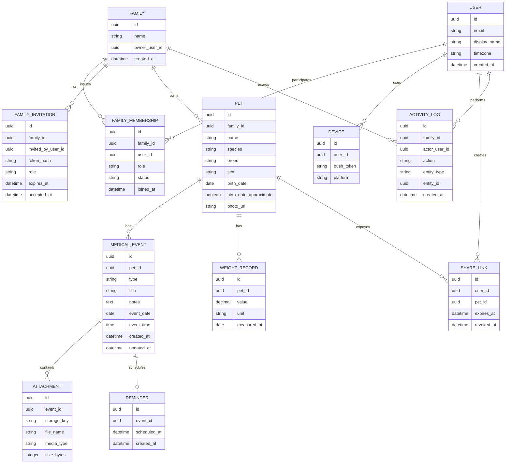
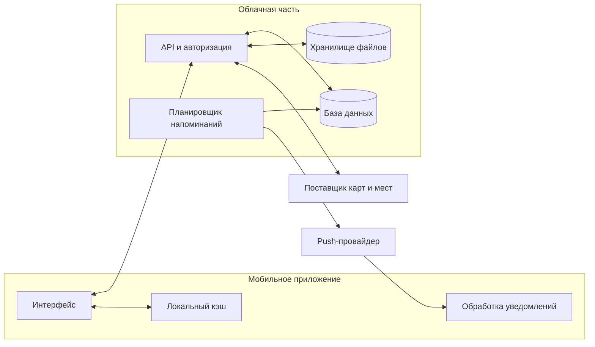

# Модель данных и архитектура

Статус: **Модель этапа 2 согласована на продуктовом уровне**

Версия: **0.2**

## 1. Основные сущности

Во втором срезе `MEDICAL_EVENT.type` ограничен значениями `vaccination`, `vet_visit`, `analysis` и `procedure`. Поле `event_time` требуется только при включённом напоминании. Напоминание всегда планируется за 24 часа до сочетания `event_date` и `event_time` и не имеет пользовательского статуса. Специализированные медицинские поля и отдельная модель лекарств в этот срез не входят. Курсы лекарств, их расписание и журнал фактических приёмов проектируются отдельно для третьего этапа; семейный доступ переносится на четвёртый этап.

## 2. Правила владения и доступа

- Все семейные группы и профили питомцев закрыты по умолчанию.
- Питомец принадлежит одной семейной группе, а доступ определяется членством и ролью пользователя в ней.
- Создатель семьи становится её владельцем и может приглашать или исключать участников.
- Участники видят данные всех питомцев семьи; выборочный доступ к отдельным питомцам не входит в первоначальную модель.
- Опасные действия ограничены ролью: удаление питомца, исключение участника и передача владения доступны только владельцу семьи.
- Изменения медицинских данных фиксируются в журнале активности с указанием автора.
- Вложения нельзя открывать по постоянной публичной ссылке.
- Временная ссылка, если включена в MVP, даёт только чтение и имеет срок действия.
- Удаление медицинского события удаляет связь с файлами; физическое удаление файлов выполняется безопасно и контролируемо.
- Удаление аккаунта запускает удаление или обезличивание связанных данных согласно принятой политике хранения.
- Сотрудник сервиса не должен просматривать медицинские документы без обоснованной поддержки и журналирования доступа.
- Владелец семьи не может выйти из неё, пока не передаст роль владельца другому участнику или не удалит семью.

## 3. Логическая архитектура MVP

## 4. Техническая реализация

### Зафиксированное решение для MVP

- интерфейс: **Vue 3, TypeScript и Ionic Vue**;
- нативная оболочка iOS и Android: **Capacitor**;
- сборка клиентской части: **Vite**;
- навигация: **Vue Router с интеграцией Ionic**;
- локальное состояние: **Pinia**;
- серверные запросы и кэш: **TanStack Query for Vue**;
- формы и валидация: **vee-validate и Zod**;
- backend-as-a-service: **Supabase**;
- база данных: **PostgreSQL с Row Level Security**;
- авторизация: **Supabase Auth**;
- файлы: **приватные buckets Supabase Storage**;
- серверная логика: **PostgreSQL functions и Supabase Edge Functions**;
- планирование напоминаний: **Supabase Cron**;
- push: **Capacitor Push Notifications, Apple Push Notification Service и Firebase Cloud Messaging**;
- сбор ошибок: **Sentry**;
- unit-тесты: **Vitest и Vue Test Utils**;
- проверка приложения на устройствах: **Maestro**;
- автоматизация сборок: **GitHub Actions, Xcode и Gradle**.

Полное обоснование и условия пересмотра находятся в [ADR-001](./06-adr-technical-stack.md).

### Граница клиентской и серверной логики

- интерфейс отвечает за отображение, локальное состояние и подготовку пользовательского ввода;
- права доступа проверяются в PostgreSQL через RLS, а не только в клиенте;
- принятие приглашения, смена ролей, передача владения, опасные удаления и совместное завершение напоминания выполняются атомарно через database functions или Edge Functions;
- push не является источником истины: состояние напоминания хранится в базе;
- ключи с правами `service_role` не попадают в мобильное приложение;
- медицинские вложения не имеют постоянных публичных URL.

### Отложенные альтернативы

- **Flutter** не выбран из-за стоимости перехода команды на Dart и отсутствия в MVP функций, которым необходим собственный высокопроизводительный рендеринг. Он остаётся вариантом пересмотра при существенном росте требований к offline-first, анимациям и нативным интеграциям.
- **React Native** не выбран из-за отсутствия опыта команды с React.
- **Собственный backend на NestJS** не нужен в MVP. Он может появиться при сложных интеграциях, тяжёлых фоновых задачах или требованиях к отдельному контуру эксплуатации.
- **Firebase как основная база** не выбран: семейная модель, роли, события и аудит естественно выражаются реляционной схемой PostgreSQL.

Статус решения: **утверждено 23 сентября 2026 года**.

## 5. Конфиденциальность и безопасность

Минимальные требования до публичного запуска:

- защищённая передача данных;
- надёжная авторизация и восстановление доступа;
- проверка прав на каждую запись и каждый файл;
- приватные хранилища с RLS и авторизованным скачиванием; короткоживущие ссылки используются только в явно предусмотренных сценариях;
- ограничение типа и размера загружаемых файлов;
- журнал критичных операций;
- резервное копирование базы;
- понятные правила удаления аккаунта;
- политика конфиденциальности и пользовательское соглашение;
- запрет хранения push-токенов в медицинских событиях или публичных данных.

## 6. Вопросы для технического решения

1. Нужны ли iOS и Android одновременно?
2. Должно ли приложение работать без сети для просмотра уже загруженной истории?
3. В каких странах планируется первый запуск? От этого зависит поставщик карт и юридические требования.
4. Какие форматы вложений обязательны: фото, PDF, лабораторные документы других форматов?
5. Какой максимальный объём хранения на одного пользователя допустим на старте?
6. Как синхронизировать расписание и фактические приёмы лекарств между устройствами до появления семейного доступа на четвёртом этапе?
