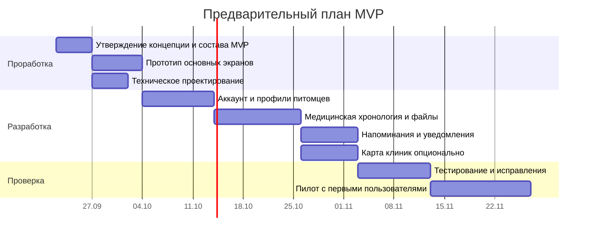

# План реализации

Статус: **Черновик для согласования**  
Версия: **0.1**

## 1. Принцип планирования

Работа делится не только по техническим слоям, а по проверяемым пользовательским результатам. Каждый этап должен завершаться сценарием, который можно показать и принять.

## 2. Этапы

Сроки являются ориентиром для небольшой команды и уточняются после выбора состава MVP, платформ и исполнителей. Карта клиник может идти параллельно с напоминаниями при наличии второго разработчика.

## 3. Результаты этапов

### Этап 0. Утверждение продукта

Результат:

- согласованная ценность и аудитория;
- точный список функций MVP;
- список функций после MVP;
- правила конфиденциальности;
- утверждённая модель ролей и совместного доступа семьи;
- утверждённые основные пользовательские потоки;
- решение о роли карты клиник;
- зафиксированный технический стек MVP: Ionic Vue, Capacitor и Supabase;
- принцип использования образа чёрного кота в визуальной системе без отдельного продуктового раздела.

Критерий готовности: на все вопросы из концепции есть зафиксированные ответы.

### Этап 1. UX-прототип

Набор экранов:

1. Приветствие и вход.
2. Создание питомца.
3. Главная с ближайшими событиями.
4. Карточка питомца.
5. Медицинская хронология.
6. Создание и просмотр события.
7. Создание и обработка напоминания.
8. Просмотр документа.
9. Карта и карточка клиники — если входит в MVP.
10. Семья: участники, приглашение и роли.
11. Профиль и настройки.

Критерий готовности: пользователь может пройти три главных сценария в кликабельном прототипе без объяснений разработчика.

### Этап 2. Технический фундамент

Результат:

- репозитории и окружения;
- авторизация;
- семейные группы, членство и проверка ролевых прав;
- модель данных и миграции;
- правила доступа;
- загрузка файлов;
- сбор ошибок и продуктовая аналитика;
- автоматическая сборка тестовых версий.

Критерий готовности: тестовый пользователь безопасно создаёт и читает только свои данные.

### Этап 3. Вертикальный срез

Первый полный рабочий сценарий:

> Создать семью → добавить питомца → пригласить участника → добавить вакцинацию с документом → назначить повтор → совместно обработать напоминание.

Критерий готовности: сценарий работает на реальном телефоне и сохраняется после переустановки приложения.

### Этап 4. Полнота MVP

Результат:

- все типы медицинских событий;
- фильтры хронологии;
- управление файлами;
- состояния напоминаний;
- несколько питомцев;
- приглашения, роли семьи и журнал совместных действий;
- настройки и удаление данных;
- карта клиник, если утверждена для MVP.

### Этап 5. Проверка качества

Проверяются:

- права доступа и невозможность увидеть чужие данные;
- права каждой семейной роли, отзыв приглашения, исключение участника и передача владения;
- доставка и повторное планирование уведомлений;
- смена часового пояса;
- плохая сеть и повтор загрузки файла;
- большие изображения и PDF;
- доступность интерфейса;
- удаление аккаунта;
- резервное восстановление;
- базовая нагрузка.

### Этап 6. Закрытый пилот

Пилотная группа: ориентировочно 15–30 владельцев питомцев.

Нужно проверить:

- понимают ли пользователи, как добавить событие;
- какие типы записей используются чаще всего;
- создают ли люди напоминания;
- возвращаются ли после первого заполнения;
- каких полей не хватает врачу или владельцу;
- доверяют ли пользователи хранению документов.

## 4. Приоритеты релизов

### MVP

Семейные группы, профили питомцев, медицинская история, документы, совместные напоминания и базовые настройки.

### Версия 1.1

Карта клиник, PDF-экспорт, временный доступ врачу, улучшенный учёт веса и лекарств.

### Версия 1.2

Расширенные права семьи, подтверждённые визиты, подготовка механизма отзывов.

### Версия 2.0

Кабинеты клиник, запись на приём, интеграции, подтверждённые отзывы, интеллектуальное распознавание документов.

## 5. Зависимости, влияющие на стоимость и сроки

- одна или две мобильные платформы;
- карта в MVP;
- временный доступ врачу;
- объём и типы файлов;
- необходимость полноценной работы без сети;
- собственный backend или облачная платформа;
- дизайн с нуля или готовая UI-библиотека;
- языки интерфейса;
- страны запуска и требования к данным.

## 6. Ближайший цикл согласования

### Решение 1 — состав MVP

Нужно выбрать один вариант:

- **Компактный:** медицинская карта и напоминания.
- **Расширенный:** компактный вариант плюс карта клиник.
- **Совместный:** расширенный вариант плюс экспорт и временный доступ врачу.

Предварительная рекомендация: **компактный MVP**, а карту клиник проектировать параллельно, но выпускать после подтверждения ценности медицинской карты.

### Решение 2 — платформы

Нужно определить, запускаемся ли одновременно на iOS и Android.

### Решение 3 — питомцы

Нужно определить, поддерживаем ли любые виды животных или оптимизируем первую версию под кошек и собак.

### Зафиксированный принцип бренда

Сеня отражается в логотипе и ненавязчивых визуальных деталях. Отдельной страницы, галереи или пользовательского раздела о нём в приложении не будет.
