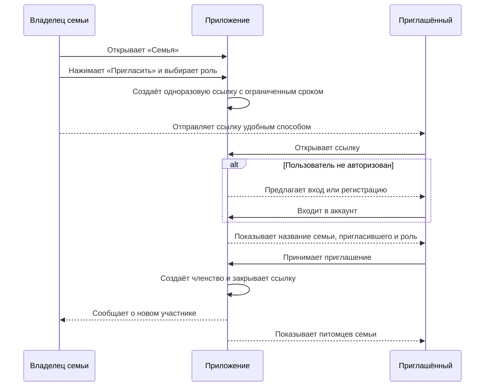
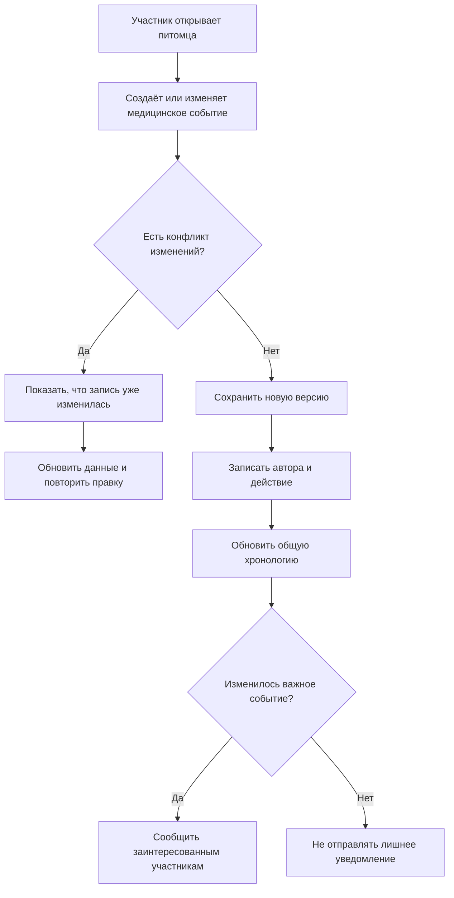
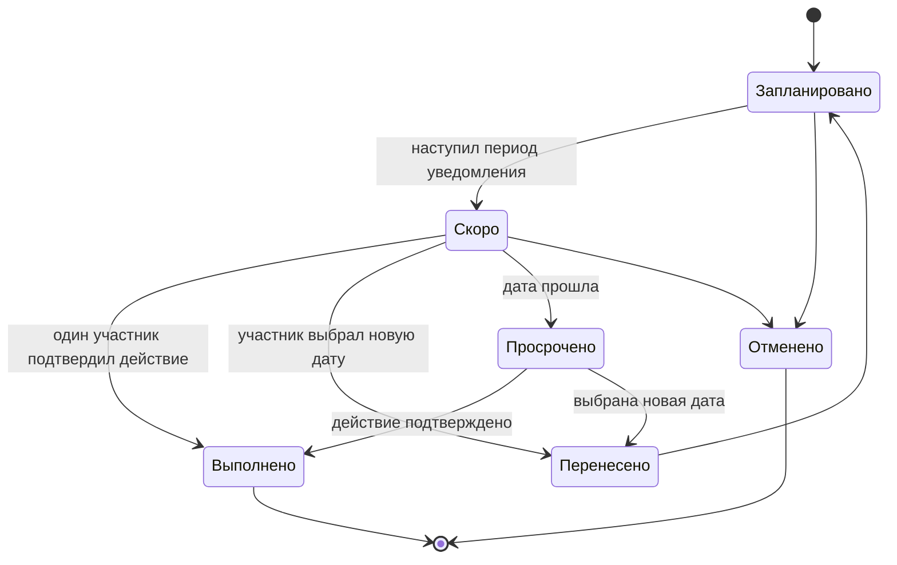
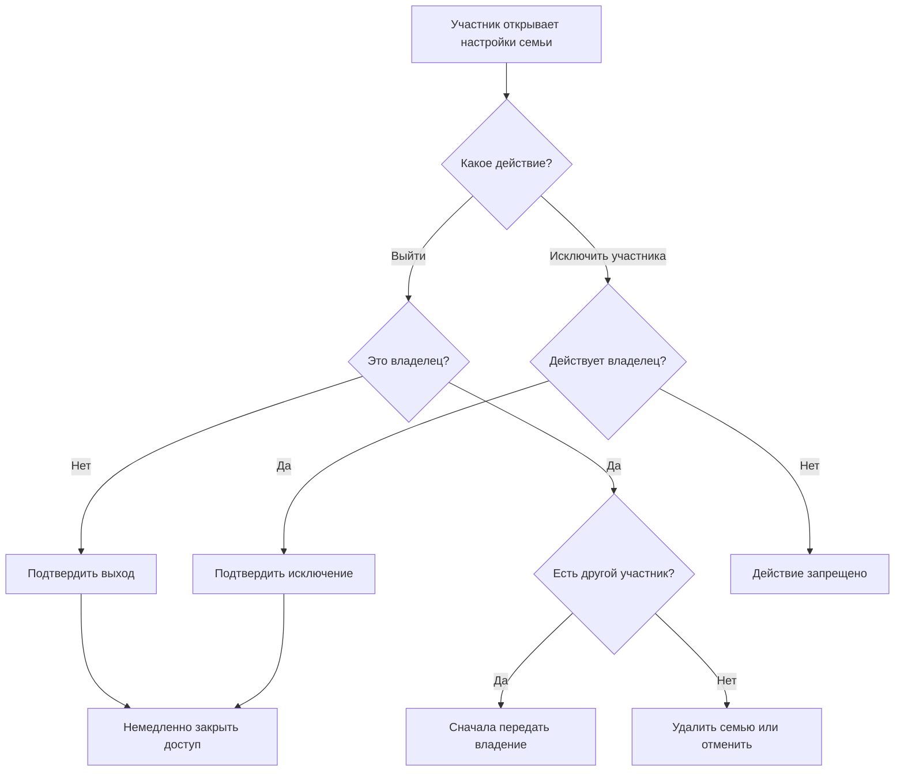

# Семья и совместный доступ

Статус: **Черновик для согласования**  
Версия: **0.1**

## 1. Назначение

«Семья» — закрытая группа пользователей, которые вместе заботятся об одних и тех же питомцах. Питомцы, медицинская история, документы и напоминания хранятся на уровне семьи, а не в личном профиле одного человека.

Главный результат: каждый участник видит актуальные данные, понимает, кто и что сделал, и не создаёт повторно уже выполненную процедуру.

## 2. Рекомендуемая модель

- При регистрации пользователь получает личную семью с рабочим названием «Моя семья».
- В семье может быть несколько питомцев и участников.
- Один питомец одновременно принадлежит только одной семье.
- Пользователь может состоять в нескольких семьях, например помогать родственнику с его питомцем.
- Весь состав семьи видит всех её питомцев. Выборочный доступ к отдельному питомцу откладывается до появления подтверждённой потребности.
- Приглашённый человек должен войти или создать собственный аккаунт.

## 3. Роли и права

| Действие | Владелец | Участник | Наблюдатель |
|---|:---:|:---:|:---:|
| Просматривать питомцев и медицинскую историю | Да | Да | Да |
| Просматривать вложения | Да | Да | Да |
| Добавлять и редактировать события | Да | Да | Нет |
| Загружать документы | Да | Да | Нет |
| Создавать и обрабатывать напоминания | Да | Да | Нет |
| Приглашать людей | Да | Нет | Нет |
| Менять роли и исключать участников | Да | Нет | Нет |
| Добавлять питомца | Да | Да | Нет |
| Удалять питомца со всей историей | Да | Нет | Нет |
| Передавать владение семьёй | Да | Нет | Нет |
| Удалять семью | Да | Нет | Нет |

Рекомендуемое правило для медицинских записей: участник может исправить или удалить созданную им запись; изменение чужой записи допускается, но требует дополнительного подтверждения и сохраняется в журнале активности. Полное удаление должно иметь период восстановления.

## 4. Создание семьи и приглашение

### Правила приглашения

- ссылка одноразовая и имеет срок действия;
- до принятия владелец может её отозвать;
- приглашение явно показывает, к каким данным появится доступ;
- повторное открытие использованной или просроченной ссылки не даёт доступ;
- один пользователь не может иметь два членства в одной семье;
- приглашение не раскрывает медицинские данные до принятия и авторизации.

## 5. Совместная работа с медицинской картой

Каждое изменение хранит автора и время. В интерфейсе достаточно короткой подписи: «Добавила Анна» или «Изменил Максим».

### Что считается важным изменением

- добавлена или отменена вакцинация;
- создано, перенесено или выполнено напоминание;
- добавлена операция, заболевание или результат анализа;
- удалена медицинская запись;
- добавлен или удалён питомец;
- изменился состав семьи или роль участника.

Обычное исправление текста не должно создавать push-уведомление всем участникам, но остаётся в журнале.

## 6. Совместные напоминания

Напоминание принадлежит семье и связано с питомцем или медицинским событием. Уведомления настраиваются отдельно каждым участником.

### Механика ответственности

- у напоминания может быть ответственный участник;
- если ответственный не выбран, уведомления получают все участники с включёнными семейными уведомлениями;
- если ответственный выбран, основной push получает он, остальные могут оставить только уведомление о просрочке;
- выполнение одним человеком закрывает напоминание для всей семьи;
- при выполнении вакцинации приложение предлагает создать новую медицинскую запись, а не просто закрыть задачу;
- в карточке отображается, кто выполнил, перенёс или отменил напоминание.

## 7. Управление питомцами в семье

### Новый питомец

Участник или владелец создаёт питомца сразу внутри выбранной семьи. Если пользователь состоит в нескольких семьях, приложение просит выбрать семью перед сохранением.

### Перенос питомца

Перенос между семьями — отдельное опасное действие:

1. Владелец исходной семьи выбирает «Передать питомца».
2. Указывает целевую семью или отправляет приглашение будущему владельцу.
3. Приложение показывает, что будет перенесено: профиль, история, документы и напоминания.
4. Владелец целевой семьи принимает передачу.
5. Питомец и все связанные данные атомарно переходят в новую семью.
6. Участники исходной семьи теряют доступ; событие остаётся в журнале без медицинских подробностей.

В MVP перенос можно заменить обращением в поддержку, если безопасная реализация заметно увеличивает срок разработки.

## 8. Выход, исключение и удаление

- После выхода или исключения пользователь сразу теряет доступ к питомцам и файлам.
- Созданные им медицинские записи сохраняются как часть истории семьи.
- Имя автора сохраняется либо заменяется нейтральной подписью согласно политике удаления аккаунта.
- Активные сессии и ранее выданные ссылки на файлы должны быть отозваны.
- Назначенные этому человеку напоминания становятся неназначенными и требуют внимания владельца.

## 9. Журнал активности

Журнал нужен для доверия и разбирательства ошибок, но не должен превращаться в социальную ленту.

Хранятся:

- автор;
- время;
- тип действия;
- объект действия;
- предыдущая и новая версия критичных полей;
- технический идентификатор устройства или сессии только для безопасности, без показа семье.

Участники видят понятные события за ограниченный период. Более подробный аудит доступен поддержке по обоснованному запросу.

## 10. Уведомления семьи

Каждый пользователь независимо включает или выключает:

- назначенные ему напоминания;
- неназначенные семейные напоминания;
- просроченные события;
- новые медицинские записи;
- изменения состава семьи;
- сервисные уведомления безопасности, которые нельзя полностью отключить.

Нельзя изменять настройки уведомлений другого участника.

## 11. Пограничные сценарии

- приглашение открыто под аккаунтом, который уже состоит в семье;
- приглашение переслано постороннему человеку;
- два участника одновременно редактируют одну запись;
- ответственный вышел из семьи;
- владелец потерял доступ к аккаунту;
- единственный владелец запросил удаление аккаунта;
- участник сохранил файл на устройство до исключения;
- питомца ошибочно создали в другой семье;
- несколько человек одновременно отметили одно напоминание выполненным;
- пользователь состоит в нескольких семьях с питомцами с одинаковыми именами.

## 12. Решения, требующие подтверждения

1. **Роли.** Оставляем три роли — владелец, участник, наблюдатель — или участники семьи должны иметь одинаковые права?
2. **Охват доступа.** Все участники видят всех питомцев семьи или требуется выбор питомцев для каждого человека?
3. **Несколько семей.** Может ли один пользователь состоять в нескольких семьях уже в MVP?
4. **Приглашение.** Достаточно универсальной ссылки или также нужен ввод e-mail/телефона внутри приложения?
5. **Ответственный.** Нужно ли назначать конкретного человека на напоминание или уведомлять всех одинаково?
6. **Удаление записей.** Может ли участник удалять чужие медицинские записи или это право только владельца?

## 13. Предварительная рекомендация для MVP

- три роли: владелец, участник, наблюдатель;
- все питомцы семьи доступны всему её составу;
- пользователь может состоять в нескольких семьях;
- приглашение по одноразовой ссылке со сроком действия;
- у напоминания может быть один ответственный;
- участники добавляют и редактируют записи, но окончательно удалять чужие записи может только владелец;
- критичные удаления сначала попадают в корзину с возможностью восстановления;
- все важные действия фиксируются в журнале активности.

